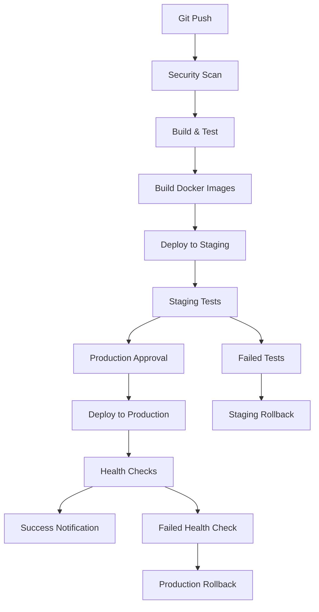

# Healthcare Platform CI/CD Deployment Guide

## 🚀 Automated Deployment Pipeline

This document describes the complete CI/CD automation pipeline that enables automatic deployment to staging on `git push` and production deployment after approval.

## 📋 Table of Contents

- [Overview](#overview)
- [Pipeline Architecture](#pipeline-architecture)
- [Environment Setup](#environment-setup)
- [Deployment Flow](#deployment-flow)
- [Security & Compliance](#security--compliance)
- [Monitoring & Rollback](#monitoring--rollback)
- [Troubleshooting](#troubleshooting)

## 🏗️ Overview

The healthcare platform uses a sophisticated CI/CD pipeline built with GitHub Actions that provides:

- **Automatic staging deployment** on every push to `main` or `develop` branches
- **Production deployment with approval** after staging validation
- **Blue-green deployment strategy** for zero-downtime production deployments
- **Comprehensive testing** including unit tests, integration tests, and E2E tests
- **Security scanning** and HIPAA compliance validation
- **Automated rollback** in case of deployment failures
- **Real-time monitoring** and alerting

## 🏛️ Pipeline Architecture



## 🛠️ Environment Setup

### Required GitHub Secrets

Configure these secrets in your GitHub repository settings:

#### Database & Infrastructure
```bash
POSTGRES_STAGING_PASSWORD=<staging-db-password>
POSTGRES_PRODUCTION_PASSWORD=<production-db-password>
REDIS_STAGING_PASSWORD=<staging-redis-password>
REDIS_PRODUCTION_PASSWORD=<production-redis-password>
```

#### Authentication & Security
```bash
JWT_STAGING_SECRET=<staging-jwt-secret>
JWT_PRODUCTION_SECRET=<production-jwt-secret>
SESSION_STAGING_SECRET=<staging-session-secret>
SESSION_PRODUCTION_SECRET=<production-session-secret>
ENCRYPTION_STAGING_KEY=<staging-encryption-key>
ENCRYPTION_PRODUCTION_KEY=<production-encryption-key>
```

#### External Services
```bash
OPENAI_STAGING_API_KEY=<openai-staging-key>
OPENAI_PRODUCTION_API_KEY=<openai-production-key>
TWILIO_STAGING_ACCOUNT_SID=<twilio-staging-sid>
TWILIO_PRODUCTION_ACCOUNT_SID=<twilio-production-sid>
TWILIO_STAGING_AUTH_TOKEN=<twilio-staging-token>
TWILIO_PRODUCTION_AUTH_TOKEN=<twilio-production-token>
```

#### Payment Processing
```bash
STRIPE_TEST_SECRET_KEY=<stripe-test-key>
STRIPE_LIVE_SECRET_KEY=<stripe-live-key>
TRANZILLA_TEST_TERMINAL=<tranzilla-test-terminal>
TRANZILLA_LIVE_TERMINAL=<tranzilla-live-terminal>
```

#### Cloud Services
```bash
AWS_STAGING_ACCESS_KEY_ID=<aws-staging-access-key>
AWS_PRODUCTION_ACCESS_KEY_ID=<aws-production-access-key>
AWS_STAGING_SECRET_ACCESS_KEY=<aws-staging-secret>
AWS_PRODUCTION_SECRET_ACCESS_KEY=<aws-production-secret>
```

#### Monitoring & Notifications
```bash
SLACK_WEBHOOK_URL=<slack-webhook-for-notifications>
GRAFANA_STAGING_PASSWORD=<grafana-staging-password>
GRAFANA_PRODUCTION_PASSWORD=<grafana-production-password>
SENTRY_STAGING_DSN=<sentry-staging-dsn>
SENTRY_PRODUCTION_DSN=<sentry-production-dsn>
```

## 🔄 Deployment Flow

### 1. Code Push Trigger

When you push code to the `main` or `develop` branch:

```bash
git add .
git commit -m "feat: add new patient management feature"
git push origin main
```

The pipeline automatically triggers and performs:

1. **Security Scanning** - Vulnerability and dependency checks
2. **Code Quality** - Linting, type checking, and code analysis
3. **Build Process** - Multi-stage Docker builds for all services
4. **Unit Testing** - Service-specific test suites with coverage reports
5. **Integration Testing** - Cross-service communication tests

### 2. Staging Deployment

After successful builds and tests:

1. **Automatic Deployment** to staging environment
2. **Health Checks** - Comprehensive service validation
3. **Smoke Tests** - End-to-end functionality verification
4. **HIPAA Compliance Check** - Healthcare-specific validations
5. **Performance Testing** - Response time and load validation

#### Staging Environment URLs:
- **Frontend**: `https://staging.clinic-app.com`
- **API**: `https://staging-api.clinic-app.com`
- **Admin Dashboard**: `https://staging.clinic-app.com/admin`
- **Monitoring**: `https://staging-monitoring.clinic-app.com`

### 3. Production Approval Process

After successful staging validation:

1. **Approval Required** - Manual approval gate for production
2. **Deployment Summary** - Review of all changes and test results
3. **Risk Assessment** - Automated analysis of deployment risk
4. **Compliance Check** - Final HIPAA and security validation

#### To Approve Production Deployment:
1. Go to GitHub Actions → Your workflow run
2. Click on "production-approval" environment
3. Review the deployment summary
4. Click "Approve deployment" if everything looks good

### 4. Production Deployment

Once approved, the system performs:

1. **Pre-deployment Backup** - Full system backup
2. **Blue-Green Deployment** - Zero-downtime strategy
3. **Database Migrations** - Schema updates if needed
4. **Health Checks** - Comprehensive validation
5. **Traffic Switching** - Gradual rollout to production
6. **Post-deployment Verification** - Final validation

#### Production Environment URLs:
- **Frontend**: `https://clinic-app.com`
- **API**: `https://api.clinic-app.com`
- **Admin Dashboard**: `https://clinic-app.com/admin`
- **Monitoring**: `https://monitoring.clinic-app.com`

## 🔒 Security & Compliance

### Security Features

- **Vulnerability Scanning** - Trivy security scanner
- **Dependency Checks** - Automated CVE detection
- **Secret Management** - GitHub Secrets with encryption
- **Container Hardening** - Non-root users, minimal attack surface
- **Network Security** - Isolated networks, secure communications

### HIPAA Compliance

- **Audit Logging** - All access and changes logged
- **Data Encryption** - At rest and in transit
- **Access Controls** - Role-based permissions
- **Business Associate Agreements** - Compliant third-party services
- **Data Retention** - Automated policy enforcement

### Compliance Validation

The pipeline automatically checks:
- ✅ Audit logging enabled
- ✅ Data encryption active  
- ✅ Access controls configured
- ✅ Backup processes working
- ✅ Security headers present
- ✅ SSL/TLS properly configured

## 📊 Monitoring & Rollback

### Monitoring Stack

- **Prometheus** - Metrics collection
- **Grafana** - Dashboards and visualization
- **Loki** - Log aggregation
- **AlertManager** - Alert routing and notifications

### Automated Rollback

The system automatically rolls back if:
- Health checks fail during deployment
- Error rates exceed thresholds
- Performance degrades significantly
- Database connectivity issues

### Manual Rollback

If needed, you can trigger manual rollback:

```bash
# Emergency rollback
./scripts/rollback-production.sh "Emergency: Critical issue detected"

# Rollback with database restoration
RESTORE_DATABASE=true ./scripts/rollback-production.sh "Data integrity issue"
```

## 🔧 Manual Deployments

### Deploy Specific Environment

You can manually trigger deployments:

1. Go to GitHub Actions
2. Click "Run workflow" on the CI/CD Pipeline
3. Select environment (staging/production)
4. Optionally skip tests for hotfixes
5. Click "Run workflow"

### Deploy Specific Version

To deploy a specific version or branch:

```bash
# Set environment variables
export IMAGE_TAG=v1.2.3
export ENVIRONMENT=production

# Run deployment
./scripts/blue-green-deploy.sh
```

## 🚨 Troubleshooting

### Common Issues

#### 1. Build Failures

**Symptom**: "Couldn't find package @clinic/common"
```bash
# Solution: Build common library first
yarn workspace @clinic/common build
```

#### 2. Health Check Failures

**Symptom**: Services not responding to health checks
```bash
# Check service logs
docker-compose logs api-gateway

# Restart specific service
docker-compose restart api-gateway
```

#### 3. Database Connection Issues

**Symptom**: "Database connection failed"
```bash
# Check database status
docker-compose exec postgres pg_isready -U postgres

# View database logs
docker-compose logs postgres
```

#### 4. Environment Variable Issues

**Symptom**: Missing or incorrect configuration
```bash
# Verify environment file
cat .env.production

# Check required secrets
echo $JWT_SECRET
```

### Recovery Procedures

#### 1. Staging Environment Recovery

```bash
# Reset staging environment
docker-compose -f docker-compose.staging.yml down
docker-compose -f docker-compose.staging.yml up -d

# Run health checks
./scripts/health-check.sh staging
```

#### 2. Production Environment Recovery

```bash
# Emergency stop
docker-compose -f docker-compose.production.yml down

# Restore from backup
./scripts/restore-production.sh <backup-id>

# Verify recovery
./scripts/health-check.sh production
```

#### 3. Database Recovery

```bash
# Find latest backup
ls -la backups/production-backup-*

# Restore database
gunzip -c backups/production-backup-YYYYMMDD-HHMMSS-database.sql.gz | \
  docker exec -i $(docker ps -q -f name=postgres) \
  psql -U postgres clinic_production
```

## 📞 Emergency Contacts

### DevOps Team
- **Email**: devops@clinic-app.com
- **Slack**: #devops-alerts
- **On-call**: Use PagerDuty integration

### Engineering Team
- **Email**: engineering@clinic-app.com  
- **Slack**: #engineering-alerts
- **Emergency**: +1-XXX-XXX-XXXX

### Compliance Team
- **Email**: compliance@clinic-app.com
- **Slack**: #compliance-alerts
- **HIPAA Officer**: hipaa@clinic-app.com

## 📚 Additional Resources

- [GitHub Actions Documentation](https://docs.github.com/en/actions)
- [Docker Multi-stage Builds](https://docs.docker.com/develop/dev-best-practices/dockerfile_best-practices/)
- [HIPAA Compliance Guide](./HIPAA_COMPLIANCE.md)
- [Security Best Practices](./SECURITY.md)
- [Monitoring Setup](./MONITORING.md)

---

## 🎉 Success! Your CI/CD Pipeline is Ready

Your healthcare platform now has a fully automated CI/CD pipeline with:

✅ **Automatic staging deployment** on every git push  
✅ **Production deployment with approval** workflow  
✅ **Comprehensive testing** and validation  
✅ **Zero-downtime blue-green deployments**  
✅ **Automated rollback** and recovery  
✅ **HIPAA compliance** built-in  
✅ **Real-time monitoring** and alerting  

Simply push your code and watch it automatically deploy to staging, then approve for production! 🚀

For support, refer to the troubleshooting section above or contact the DevOps team.